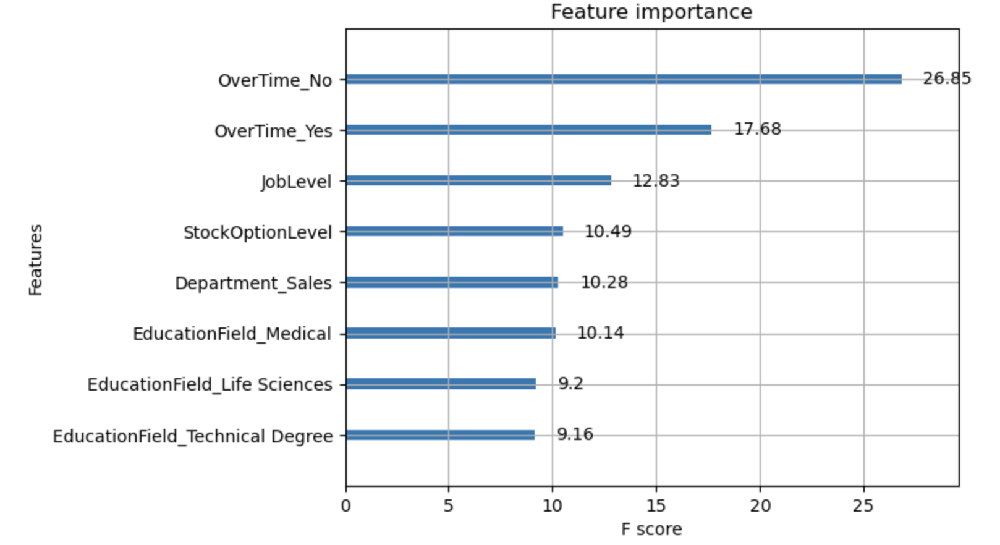

# Employee_Turnover_Analysis

## Overview
* Utilized XGBoost, Random Forest model to predict employee turnover rate with variables like age, job_level
* Analyzed feature importance to  determine benifits for employees and optimize internal operation decision

## Insight
Employees care more about whether they work overtime, future value of the company like stocks, and also their job levels. If the promotion is too slow, they might jump to other company for better position. 

